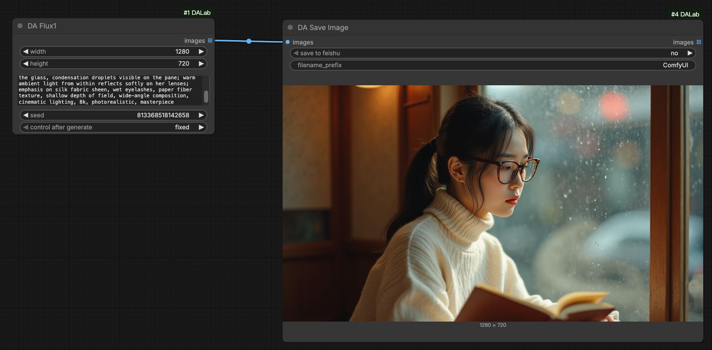
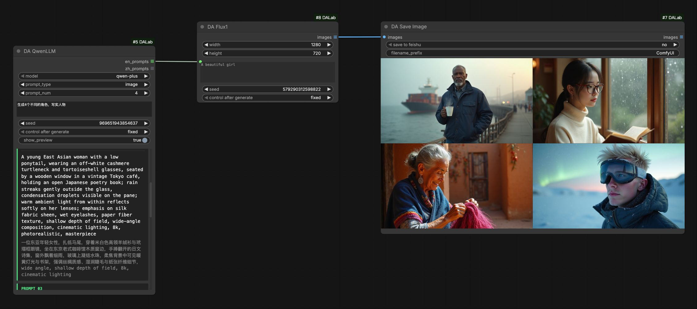
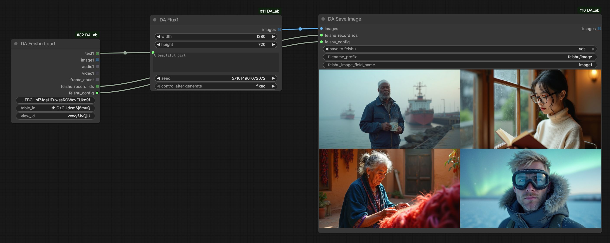
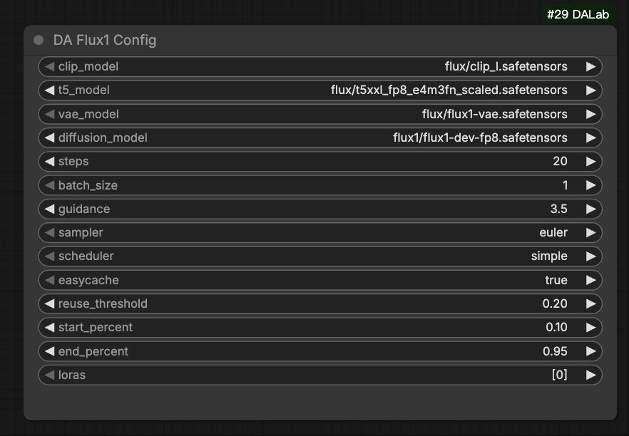

# Flux.1 集成节点

## 1. 基本示意

### 基础生成 (Basic Usage)
最简单的使用方式：配置完成后，直接输入提示词即可生成。

### 批量生成：搭配 Qwen LLM
利用 **DA Qwen LLM** 节点批量生成创意提示词，实现自动连播。
[Qwen LLM 使用说明](../text/qwen_llm.md)

### 批量生成：搭配 Feishu 多维表格
利用 **DA Feishu Load** 读取云端表格内容，实现自动化生产流。
[Feishu 飞书集成说明](../tools/feishu.md)

## 2. 节点配置说明

**DA Flux1 Config** 节点用于管理模型路径与采样参数。
> Global Config (全局配置): 搭配 [Global Config](../tools/global_config.md) 节点使用，用来管理运行时的显存控制。

| 参数名 | 默认值 | 说明 |
| :--- | :--- | :--- |
| clip_model | clip_l.safetensors | CLIP 文本编码器，通常使用 clip_l。 |
| t5_model | t5xxl_fp8... | T5 文本编码器，推荐使用 FP8 版本以节省显存。 |
| vae_model | flux1-vae.safetensors | 图像解码 VAE 模型。 |
| diffusion_model | flux1-dev-fp8.safetensors | Flux 核心扩散模型 (Transformer)。 |
| steps | 20 | 采样步数。Dev 模型推荐 20-30 步，Schnell 模型 4 步即可。 |
| batch_size | 1 | 单次生成的图片数量。 |
| guidance | 3.5 | 提示词引导系数。Flux Dev 推荐 3.5，Schnell 推荐 1.0 (或更低)。 |
| sampler | euler | 采样算法。推荐使用 euler。 |
| scheduler | simple | 噪声调度器。推荐使用 simple。 |
| easycache | - | 开启模型缓存，显著提升连续生成的响应速度。 |
| loras | - | 选择加载 LoRA 模型（支持多个 LoRA 叠加）。 |

## 3. 环境依赖
**无特殊依赖**。安装 **ComfyUI-DALab** 插件即可直接使用。

## 4. 模型下载
> **提示**：如果您之前已经下载过 FLUX.1 相关模型，直接使用即可，无需重复下载。

若未下载，请参考下方列表放置于 ComfyUI 对应目录：

#### 1. Diffusion 模型 (UNet)
存放路径: `models/diffusion_models/`

| 模型版本 | 说明 | 下载地址 |
| :--- | :--- | :--- |
| Dev (BF16) | 官方原版，最高画质，显存要求高 | [下载](https://huggingface.co/black-forest-labs/FLUX.1-dev/blob/main/flux1-dev.safetensors) |
| Dev (FP8) | FP8 量化版，RTX 40 系列及以上显卡支持加速 | [下载](https://huggingface.co/black-forest-labs/FLUX.1-dev-FP8/blob/main/flux1-dev-fp8.safetensors) |
| Dev (NVFP4) | NVFP4 量化版，RTX 50 系列及以上显卡支持加速 | [下载](https://huggingface.co/black-forest-labs/FLUX.1-dev-NVFP4/blob/main/flux1-dev-nvfp4.safetensors) |

#### 2. T5 文本编码器 (Text Encoder)
存放路径: `models/text_encoders/`

| 模型版本 | 说明 | 下载地址 |
| :--- | :--- | :--- |
| (FP16) | T5 FP16 原版，精度更高但显存占用大 | [下载](https://huggingface.co/comfyanonymous/flux_text_encoders/blob/main/t5xxl_fp16.safetensors) |
| (FP8) | T5 FP8 量化版 (Scaled)，节省显存 (推荐) | [下载](https://huggingface.co/comfyanonymous/flux_text_encoders/blob/main/t5xxl_fp8_e4m3fn_scaled.safetensors) |

#### 3. CLIP 文本编码器 (Text Encoder)
存放路径: `models/text_encoders/`

| 模型版本 | 说明 | 下载地址 |
| :--- | :--- | :--- |
| Default | CLIP ViT-L 模型，Flux 必须模型 | [下载](https://huggingface.co/comfyanonymous/flux_text_encoders/blob/main/clip_l.safetensors) |

#### 4. VAE 模型
存放路径: `models/vae/`

| 模型版本 | 说明 | 下载地址 |
| :--- | :--- | :--- |
| Default | Flux 官方 VAE 模型 | [下载](https://huggingface.co/black-forest-labs/FLUX.1-dev/blob/main/ae.safetensors) |
