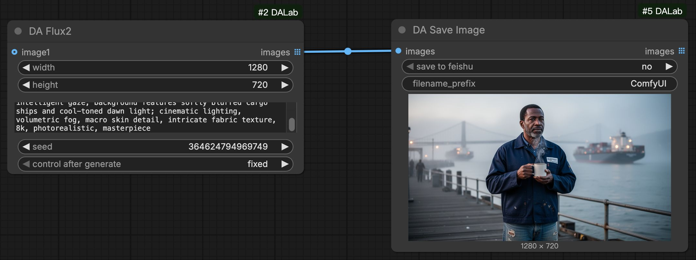
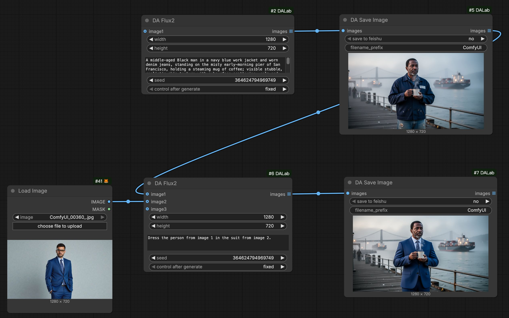
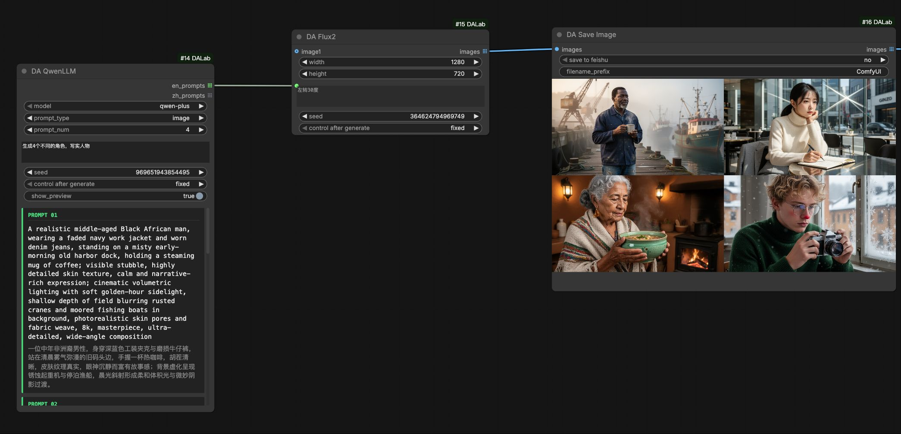
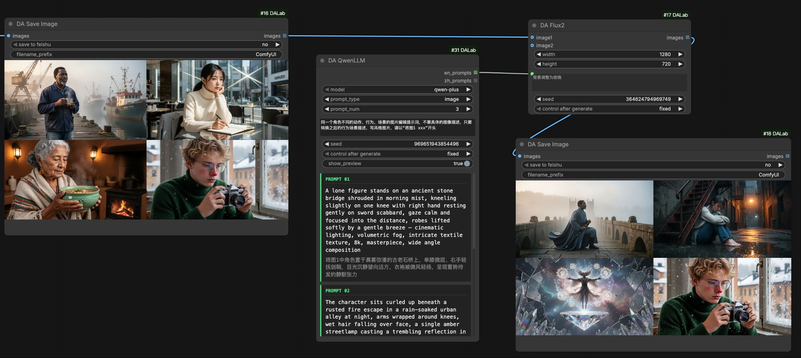
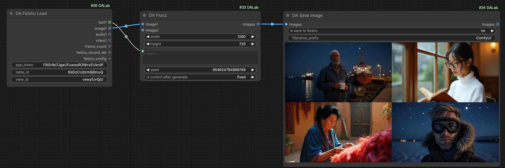
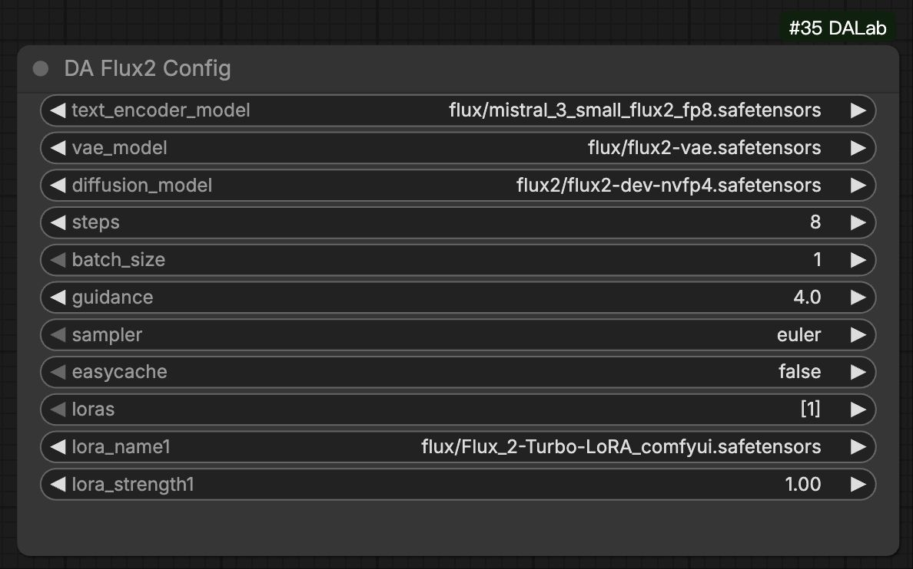

# DA Flux2 Node Usage
[English](flux2.md) | [中文文档](flux2_zh.md)

## 1. Basic Illustrations

### Basic T2I (Text-to-Image)
Simplest usage: After configuration, just enter prompts to generate images.

### Basic I2I (Image-to-Image)
Supports image-guided generation. Connect reference images to the `images` port for style transfer or repainting.

### Batch T2I: With Qwen LLM
Use **DA Qwen LLM** to generate creative prompts in batch for automated continuous generation.
[Qwen LLM Node Usage](../text/qwen_llm.md)

### Batch I2I: With Qwen LLM
Combine queued prompts from Qwen LLM with reference images for batch style editing.

### Batch I2I: With Feishu
Use **DA Feishu Load** to read prompts and image URLs from a table for fully automated batch image editing.
[Feishu Node Usage](../tools/feishu.md)

## 2. Configuration Setup

**DA Flux2 Config** node manages parameters for the Flux.2 model.
> Global Config: Use with [Global Config](../tools/global_config.md) node to manage runtime VRAM control.

| Parameter | Default | Description |
| :--- | :--- | :--- |
| text_encoder_model | Mistral Small | Flux2 Text Encoder (Mistral). |
| vae_model | Flux2 VAE | Flux2 dedicated VAE model. |
| diffusion_model | Flux2 | Flux2 Core Diffusion Model (NVFP4 Quantized). |
| steps | 20 | Sampling steps. Default is 20. |
| batch_size | 1 | Number of images per generation. |
| guidance | 4.0 | Guidance scale. Flux2 default is 4.0. |
| sampler | euler | Sampling algorithm. 'euler' recommended. |
| easycache | - | Enable model caching to significantly speed up continuous generation. |
| loras | - | Select LoRA models (supports stacking). |

**DA Flux2 (Generation Node)**
In addition to standard width/height and prompts, the Flux.2 node supports an **images** list input, accepting up to 10 reference images for editing or guidance.

## 3. Environment Dependencies
**No special dependencies**. Just install **ComfyUI-DALab** extension to use.

## 4. Model Downloads
> **Note**: If you have already downloaded FLUX.2 models, you can use them directly.

If not, please refer to the list below:

#### 1. Diffusion Model (UNet)
Path: `models/diffusion_models/`

| Version | Description | Download |
| :--- | :--- | :--- |
| **Dev (BF16)** | Official Original, Best Quality | [Download](https://huggingface.co/black-forest-labs/FLUX.2-dev/blob/main/flux2-dev.safetensors) |
| **Dev (FP8)** | FP8 Mixed Quant (Comfy-Org), Recommended for most GPUs | [Download](https://huggingface.co/Comfy-Org/flux2-dev/blob/main/split_files/diffusion_models/flux2_dev_fp8mixed.safetensors) |
| **Dev (NVFP4)** | NVFP4 Quantized, Accelerated on RTX 50+ | [Download](https://huggingface.co/black-forest-labs/FLUX.2-dev-NVFP4/blob/main/flux2-dev-nvfp4-mixed.safetensors) |

*(Note: NVFP4 is currently recommended for Flux.2 balance between performance and VRAM)*

#### 2. Text Encoder (Mistral)
Path: `models/text_encoders/`

| Version | Description | Download |
| :--- | :--- | :--- |
| **Mistral Small (BF16)** | Official Original, High Precision | [Download](https://huggingface.co/Comfy-Org/flux2-dev/blob/main/split_files/text_encoders/mistral_3_small_flux2_bf16.safetensors) |
| **Mistral Small (FP8)** | FP8 Quantized, Recommended for most GPUs | [Download](https://huggingface.co/Comfy-Org/flux2-dev/blob/main/split_files/text_encoders/mistral_3_small_flux2_fp8.safetensors) |
| **Mistral Small (NVFP4)** | NVFP4 (FP4 Mixed), Accelerated on RTX 50+ | [Download](https://huggingface.co/Comfy-Org/flux2-dev/blob/main/split_files/text_encoders/mistral_3_small_flux2_fp4_mixed.safetensors) |

#### 3. VAE Model
Path: `models/vae/`

| Version | Description | Download |
| :--- | :--- | :--- |
| **Default** | Official VAE Model (ae.safetensors) | [Download](https://huggingface.co/black-forest-labs/FLUX.2-dev/blob/main/ae.safetensors) |

#### 5. LoRA Model (Optional)
Path: `models/loras/`

| Version | Description | Download |
| :--- | :--- | :--- |
| **8-Step Turbo** | Turbo LoRA for 8-step generation | [Download](https://huggingface.co/Comfy-Org/flux2-dev/blob/main/split_files/loras/Flux_2-Turbo-LoRA_comfyui.safetensors) |
