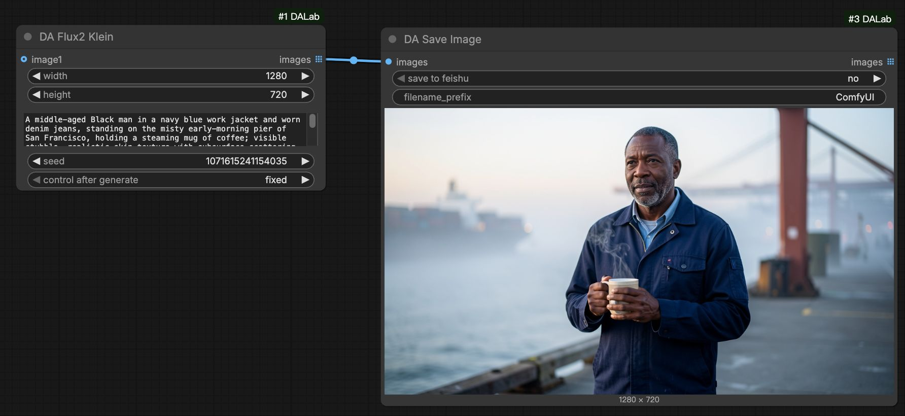
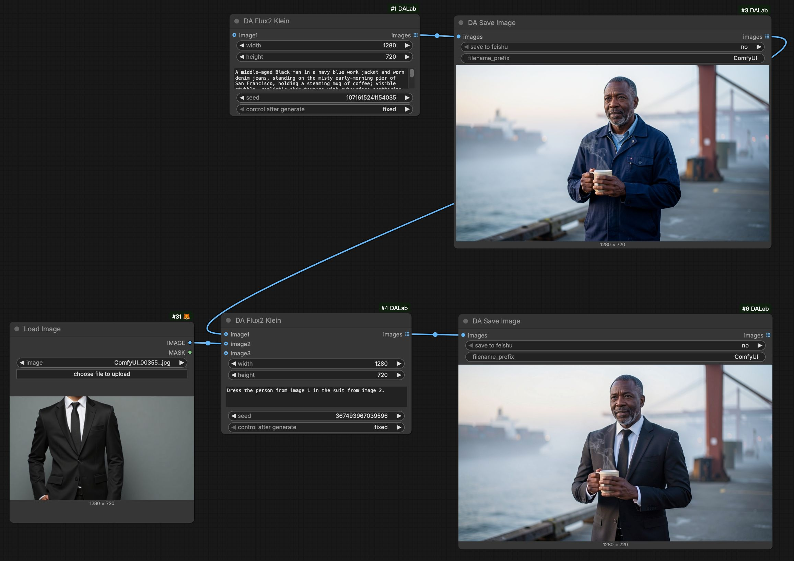
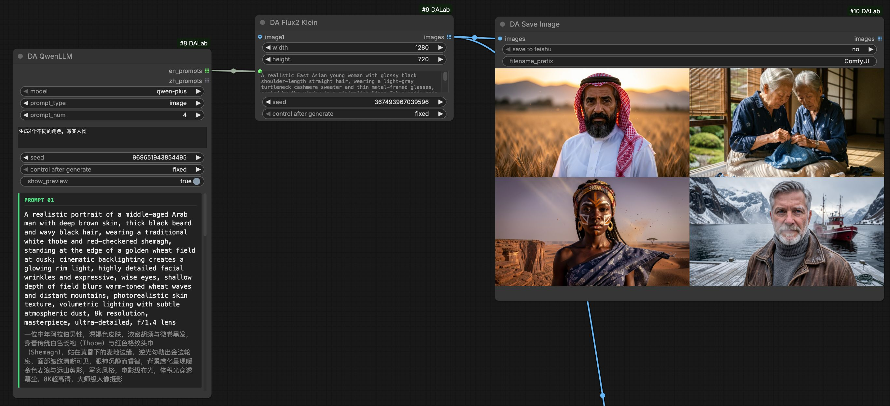
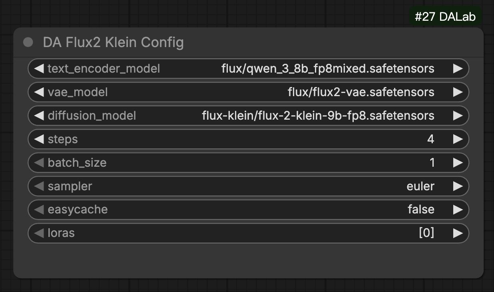

# DA Flux2 Klein 节点说明
[English](flux2_klein.md) | [中文文档](flux2_klein_zh.md)

## 1. 基本示意

### 基础文生图 (Basic T2I)
最简单的使用方式：配置完成后，输入提示词即可生成图片。

### 基础编辑图 (Basic I2I)
支持图像引导生成 (Img2Img)，将参考图像连接至 `images` 端口，实现风格迁移或重绘。

### 批量文生图：搭配 Qwen LLM
利用 **DA Qwen LLM** 批量生成创意提示词，实现自动化连续生成。
[Qwen LLM 节点说明](../text/qwen_llm.md)

### 批量编辑图片：搭配 Feishu 多维表格
利用 **DA Feishu Load** 读取表格中的提示词与图像 URL，实现全自动化的批量图像编辑流。
[Feishu 节点说明](../tools/feishu.md)

## 2. 节点配置说明

**DA Flux2 Klein Config** 节点用于管理 Flux2 Klein 模型的参数配置。
> Global Config (全局配置): 搭配 [Global Config](../tools/global_config.md) 节点使用，用来管理运行时的显存控制。

| 参数名 | 默认值 | 说明 |
| :--- | :--- | :--- |
| text_encoder_model | Qwen 3.8B | Flux2 Klein 专用文本编码器。 |
| vae_model | Flux2 VAE | Flux2 通用 VAE 模型。 |
| diffusion_model | Flux2 Klein | Flux2 Klein 核心扩散模型 (9B FP8)。 |
| steps | 4 | 采样步数。Klein 模型仅需 4 步即可生成。 |
| batch_size | 1 | 单次生成的图片数量。 |
| sampler | euler | 采样算法。推荐使用 euler。 |
| easycache | - | 开启模型缓存，显著提升连续生成的响应速度。 |
| loras | - | 选择加载 LoRA 模型（支持多个 LoRA 叠加）。 |

**DA Flux2 Klein (生成节点)**
支持 **images** 列表输入，最多支持 10 张参考图像用于编辑或引导。

## 3. 环境依赖
**无特殊依赖**。安装 **ComfyUI-DALab** 插件即可直接使用。

## 4. 模型下载
> **提示**：如果您之前已经下载过相关模型，直接使用即可。

#### 1. Diffusion 模型 (UNet)
存放路径: `models/diffusion_models/`

| 模型版本 | 说明 | 下载地址 |
| :--- | :--- | :--- |
| **Klein (9B FP8)** | Flux2 蒸馏量化版，9B参数，4步生成，显存友好 | [待更新] |

#### 2. Text Encoder
存放路径: `models/text_encoders/`

| 模型版本 | 说明 | 下载地址 |
| :--- | :--- | :--- |
| **Qwen 3.8B (FP8)** | Flux2 Klein 专用文本编码器 | [待更新] |

#### 3. VAE 模型
存放路径: `models/vae/`

| 模型版本 | 说明 | 下载地址 |
| :--- | :--- | :--- |
| **Default** | 官方 VAE 模型 (ae.safetensors) | [下载](https://huggingface.co/black-forest-labs/FLUX.2-dev/blob/main/ae.safetensors) |
