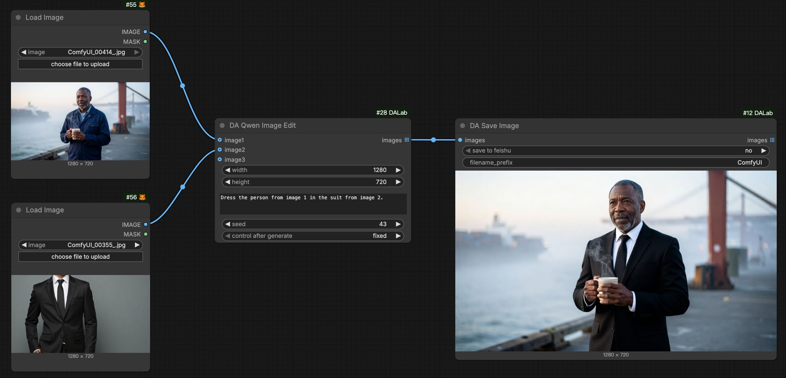
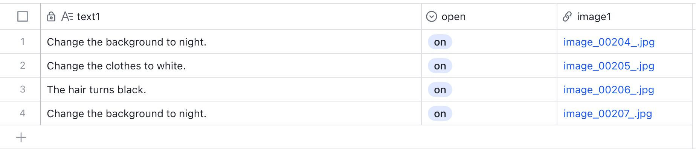
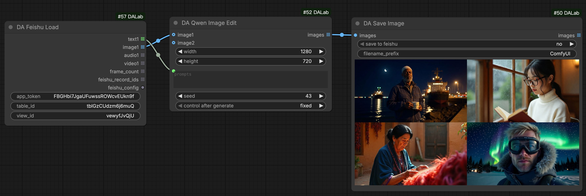
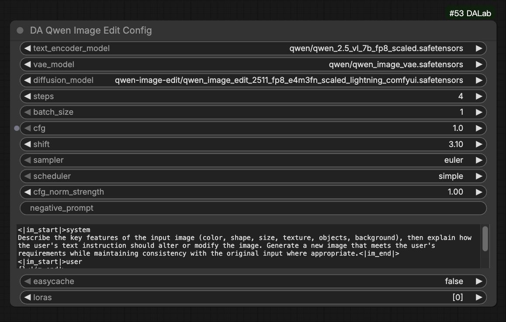

# DA Qwen Image Edit 节点说明
[English](qwen_image_edit.md) | [中文文档](qwen_image_edit_zh.md)

## 1. 基本示意

### 基础图像编辑 (Single I2I)
支持图像编辑与重绘。将输入图像连接至 `images` 端口，并提供提示词以引导编辑过程。

### 批量图像编辑：搭配 Feishu 多维表格
利用 **DA Feishu Load** 读取表格中的提示词与图片链接，实现全自动化的批量图像编辑。
[Feishu 节点说明](../tools/feishu.md)

## 2. 节点配置说明

**DA Qwen Image Edit Config** 节点用于管理 Qwen Image Edit 模型的参数配置。
> Global Config (全局配置): 搭配 [Global Config](../tools/global_config.md) 节点使用，用来管理运行时的显存控制。

| 参数名 | 默认值 | 说明 |
| :--- | :--- | :--- |
| text_encoder_model | Qwen 2.5 VL | Qwen VL 文本编码器 (FP8)。 |
| vae_model | Qwen VAE | Qwen 专用 VAE 模型。 |
| diffusion_model | Qwen Image Edit | Qwen Image Edit 核心扩散模型。 |
| steps | 4 | 采样步数。默认为 4 步。 |
| batch_size | 1 | 单次生成的图片数量。 |
| cfg | 1.0 | 提示词引导系数。 |
| shift | 3.10 | 采样偏移参数。默认为 3.10。 |
| cfg_norm_strength | 1.0 | CFG 归一化强度。默认为 1.0。 |
| sampler | euler | 采样算法。 |
| scheduler | simple | 噪声调度器。 |
| negative_prompt | - | 负面提示词。默认为空。 |
| easycache | - | 开启模型缓存，显著提升连续生成的响应速度。 |
| loras | - | 选择加载 LoRA 模型。 |

**DA Qwen Image Edit (生成节点)**
需要连接 **prompts** (提示词) 和 **images** (像素图像) 输入。

## 3. 环境依赖
**无特殊依赖**。安装 **ComfyUI-DALab** 插件即可直接使用。

## 4. 模型下载
> **提示**：如果您之前已经下载过相关模型，直接使用即可。

#### 1. Diffusion 模型 (UNet)
存放路径: `models/diffusion_models/`

| 模型版本 | 说明 | 下载地址 |
| :--- | :--- | :--- |
| **Qwen Image Edit** | Qwen 图像编辑扩散模型 | [下载](https://huggingface.co/Comfy-Org/Qwen-Image-Edit_ComfyUI/tree/main/split_files/diffusion_models) |

#### 2. Text Encoder (VL)
存放路径: `models/text_encoders/`

| 模型版本 | 说明 | 下载地址 |
| :--- | :--- | :--- |
| **Qwen 2.5 VL** | Qwen 2.5 VL 视觉语言模型 | [下载](https://huggingface.co/Comfy-Org/Qwen-Image_ComfyUI/tree/main/split_files/text_encoders) |

#### 3. VAE 模型
存放路径: `models/vae/`

| 模型版本 | 说明 | 下载地址 |
| :--- | :--- | :--- |
| **Qwen Image VAE** | 专用 VAE 模型 | [下载](https://huggingface.co/Comfy-Org/Qwen-Image_ComfyUI/tree/main/split_files/vae) |

#### 4. LoRA 模型 (可选)
存放路径: `models/loras/`

| 模型版本 | 说明 | 下载地址 |
| :--- | :--- | :--- |
| **Lightx2v** | 加速 LoRA | [下载](https://huggingface.co/lightx2v/Qwen-Image-Lightning/tree/main) |
| **Multiple Angles** | 多视角生成 LoRA | [下载](https://huggingface.co/fal/Qwen-Image-Edit-2511-Multiple-Angles-LoRA) |
