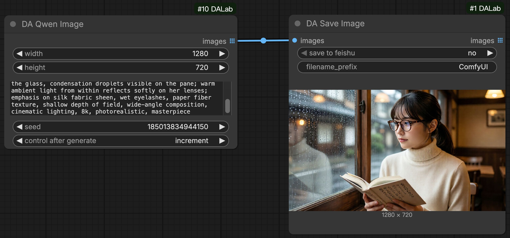
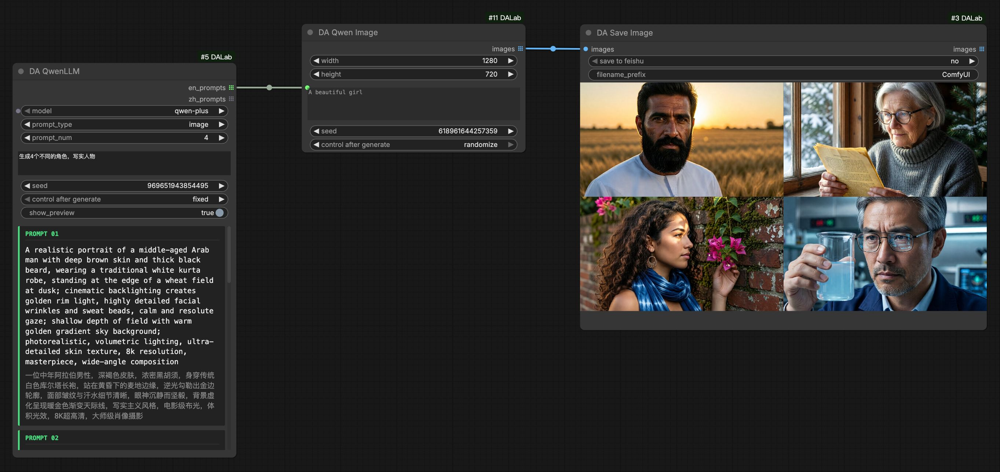
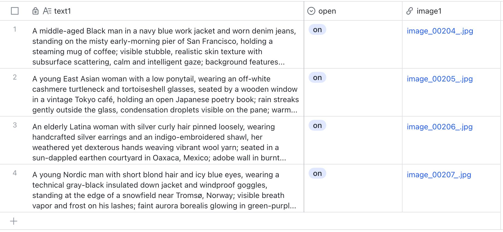
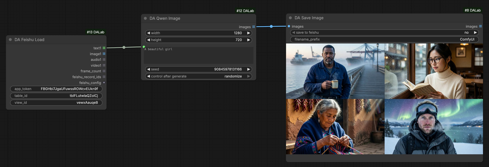
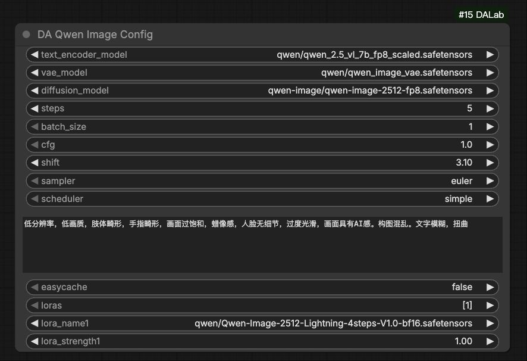

# DA Qwen Image 节点说明
[English](qwen_image.md) | [中文文档](qwen_image_zh.md)

## 1. 基本示意

### 基础文生图 (Basic T2I)
最简单的使用方式：配置完成后，输入提示词即可生成图片。

### 批量文生图：搭配 Qwen LLM
利用 **DA Qwen LLM** 批量生成创意提示词，实现自动化连续生成。
[Qwen LLM 节点说明](../text/qwen_llm.md)

### 批量文生图：搭配 Feishu 多维表格
利用 **DA Feishu Load** 读取表格中的提示词，实现全自动化的批量生产。
[Feishu 节点说明](../tools/feishu.md)

## 2. 节点配置说明

**DA Qwen Image Config** 节点用于管理 Qwen Image 模型的参数配置。
> Global Config (全局配置): 搭配 [Global Config](../tools/global_config.md) 节点使用，用来管理运行时的显存控制。

| 参数名 | 默认值 | 说明 |
| :--- | :--- | :--- |
| text_encoder_model | Qwen 2.5 VL | Qwen VL 文本编码器 (FP8)。 |
| vae_model | Qwen VAE | Qwen Image 专用 VAE 模型。 |
| diffusion_model | Qwen Image | Qwen Image 核心扩散模型 (FP8)。 |
| steps | 5 | 采样步数。默认为 5 步。 |
| batch_size | 1 | 单次生成的图片数量。 |
| cfg | 1.0 | 提示词引导系数。默认为 1.0 (Lightning LoRA)。 |
| shift | 3.10 | 采样偏移参数。默认为 3.10。 |
| sampler | euler | 采样算法。推荐使用 euler。 |
| scheduler | simple | 噪声调度器。推荐使用 simple。 |
| negative_prompt | (默认负面词) | 负面提示词，配置节点内置了针对性的通用负面词。 |
| easycache | - | 开启模型缓存，显著提升连续生成的响应速度。 |
| loras | - | 选择加载 LoRA 模型。 |

## 3. 环境依赖
**无特殊依赖**。安装 **ComfyUI-DALab** 插件即可直接使用。

## 4. 模型下载
> **提示**：如果您之前已经下载过相关模型，直接使用即可。

#### 1. Diffusion 模型 (UNet)
存放路径: `models/diffusion_models/`

| 模型版本 | 说明 | 下载地址 |
| :--- | :--- | :--- |
| **Qwen Image** | Qwen Image 扩散模型 | [下载](https://huggingface.co/Comfy-Org/Qwen-Image_ComfyUI/tree/main/split_files/diffusion_models) |

#### 2. Text Encoder (VL)
存放路径: `models/text_encoders/`

| 模型版本 | 说明 | 下载地址 |
| :--- | :--- | :--- |
| **Qwen 2.5 VL** | Qwen 2.5 VL 视觉语言模型 | [下载](https://huggingface.co/Comfy-Org/Qwen-Image_ComfyUI/tree/main/split_files/text_encoders) |

#### 3. VAE 模型
存放路径: `models/vae/`

| 模型版本 | 说明 | 下载地址 |
| :--- | :--- | :--- |
| **Qwen Image VAE** | 专用 VAE 模型 | [下载](https://huggingface.co/Comfy-Org/Qwen-Image_ComfyUI/tree/main/split_files/vae) |

#### 4. LoRA 模型 (可选)
存放路径: `models/loras/`

| 模型版本 | 说明 | 下载地址 |
| :--- | :--- | :--- |
| **Lightx2v** | 加速 LoRA | [下载](https://huggingface.co/lightx2v/Qwen-Image-Lightning/tree/main) |
