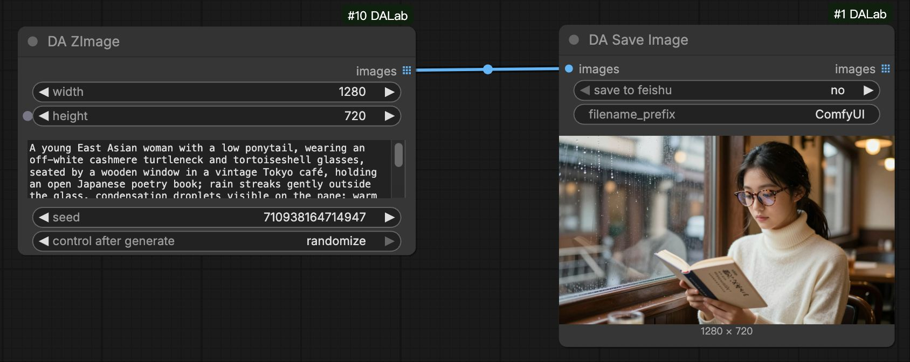
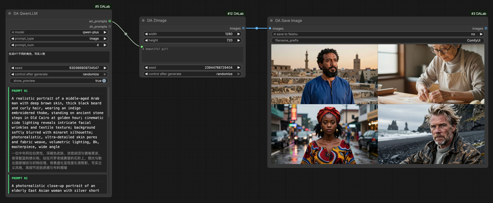
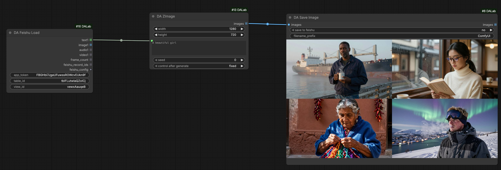
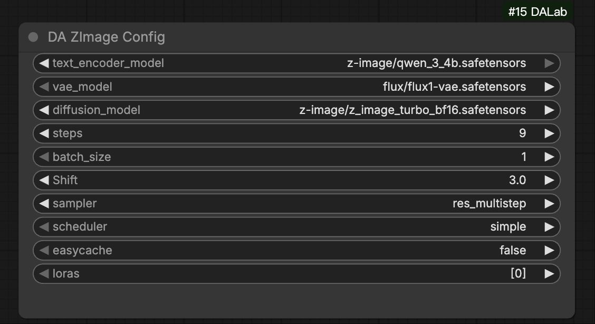

# DA ZImage Node Usage
[English](zimage.md) | [中文文档](zimage_zh.md)

## 1. Basic Illustrations

### Basic T2I (Text-to-Image)
Simplest usage: After configuration, just enter prompts to generate images.

### Batch T2I: With Qwen LLM
Use **DA Qwen LLM** to generate creative prompts in batch for automated continuous generation.
[Qwen LLM Node Usage](../text/qwen_llm.md)

### Batch T2I: With Feishu
Use **DA Feishu Load** to read prompts from a table for fully automated batch generation.
[Feishu Node Usage](../tools/feishu.md)

## 2. Configuration Setup

**DA ZImage Config** node manages parameters for the ZImage model.
> Global Config: Use with [Global Config](../tools/global_config.md) node to manage runtime VRAM control.

| Parameter | Default | Description |
| :--- | :--- | :--- |
| text_encoder_model | Qwen 3 4B | ZImage Text Encoder. |
| vae_model | ZImage VAE | ZImage dedicated VAE model. |
| diffusion_model | ZImage | ZImage Core Diffusion Model. |
| steps | 9 | Sampling steps. Default is 9. |
| batch_size | 1 | Number of images per generation. |
| cfg | 1.0 | CFG Scale. |
| shift | 3.0 | Sampling shift parameter. Default is 3.0. |
| sampler | res_multistep | Sampling algorithm. 'res_multistep' recommended. |
| scheduler | simple | Noise scheduler. |

| easycache | - | Enable model caching to significantly speed up continuous generation. |
| loras | - | Select LoRA models. |

**DA ZImage (Generation Node)**
Only supports **prompts** list input for batch text-to-image generation.

## 3. Environment Dependencies
**No special dependencies**. Just install **ComfyUI-DALab** extension to use.

## 4. Model Downloads
> **Note**: If you have already downloaded the models, you can use them directly.

#### 1. Diffusion Model (UNet)
Path: `models/diffusion_models/`

| Version | Description | Download |
| :--- | :--- | :--- |
| **ZImage** | ZImage Diffusion Model | [Pending Update] |

#### 2. Text Encoder
Path: `models/text_encoders/`

| Version | Description | Download |
| :--- | :--- | :--- |
| **ZImage Text Encoder** | ZImage Text Encoder | [Pending Update] |

#### 3. VAE Model
Path: `models/vae/`

| Version | Description | Download |
| :--- | :--- | :--- |
| **ZImage VAE** | Dedicated VAE Model | [Pending Update] |
