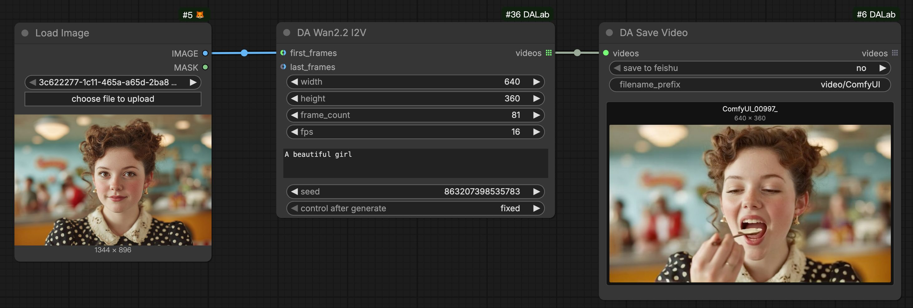
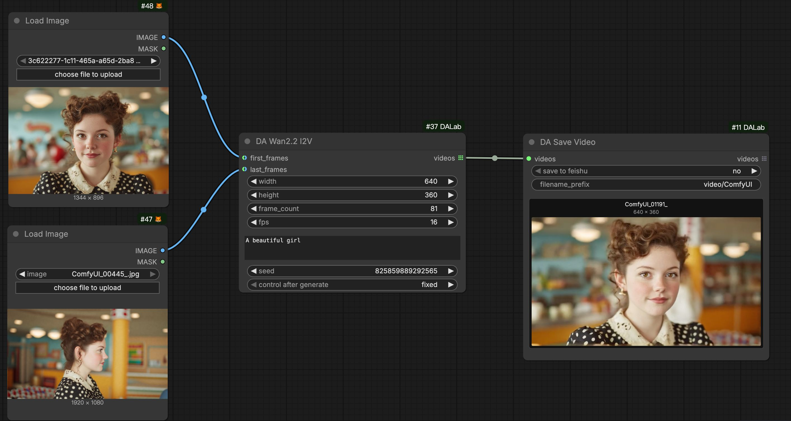
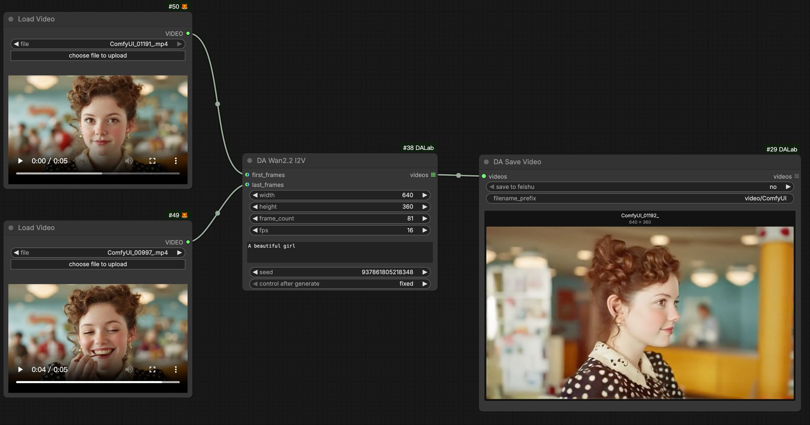
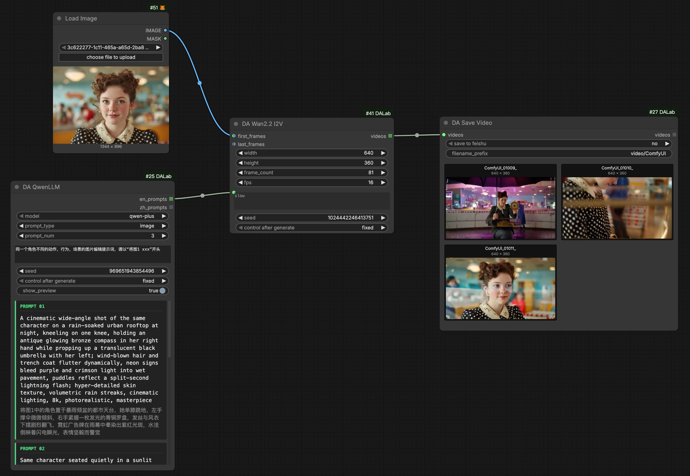
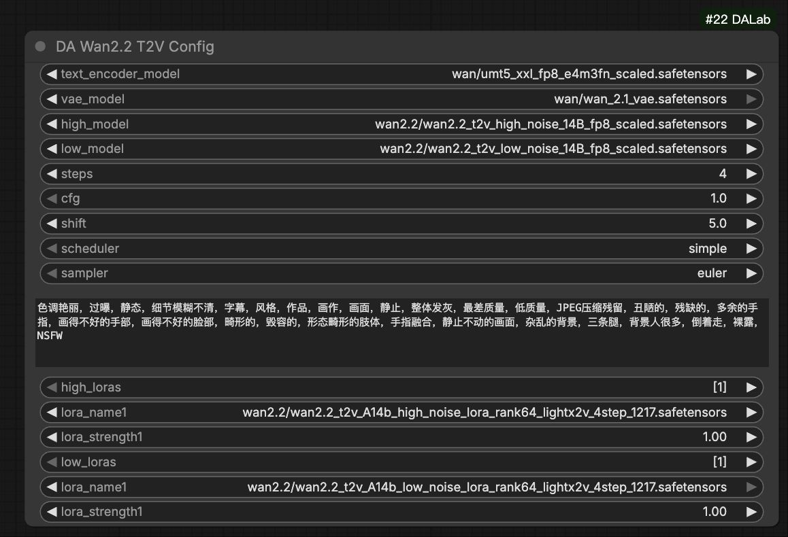

# DA Wan 2.2 I2V 节点说明
[English](wan22_i2v.md) | [中文文档](wan22_i2v_zh.md)

## 1. 基本示意

### 1. 首帧生视频 (First Frame to Video)
最基础的图生视频用法。将图片连接至 `first_frames` 端口作为起始帧。

### 2. 首尾帧生视频 (First & Last Frame)
生成一段连接两张图片的过渡视频。将图片分别连接至 `first_frames` 和 `last_frames`。

### 3. 视频生成视频 (Video Bridge)
生成两段现有视频之间的过渡片段。
- **First Frame 输入**: 支持输入视频，自动使用该视频的 **最后一帧**。
- **Last Frame 输入**: 支持输入视频，自动使用该视频的 **第一帧**。

### 4. 批量图生视频：搭配 Qwen LLM
利用 **DA Qwen LLM** 生成多个提示词，实现批量视频生成。

## 2. 节点配置说明

**DA Wan2.2 I2V Config** 节点用于管理 Wan 2.2 I2V 模型的参数配置。
> Global Config (全局配置): 搭配 [Global Config](../tools/global_config.md) 节点使用，用来管理运行时的显存控制。

| 参数名 | 默认值 | 说明 |
| :--- | :--- | :--- |
| text_encoder_model | UMT5 XXL | Wan T5 文本编码器 (FP8)。 |
| vae_model | Wan 2.1 VAE | Wan VAE 模型。 |
| high_model | Wan 2.2 I2V High | Wan 2.2 I2V 高噪点扩散模型 (14B)。 |
| low_model | Wan 2.2 I2V Low | Wan 2.2 I2V 低噪点扩散模型 (14B)。 |
| steps | 4 | 采样步数。默认为 4 步 (加速版)。 |
| batch_size | 1 | 单次生成的视频数量。 |
| cfg | 1.0 | 提示词引导系数。默认为 1.0。 |
| shift | 5.0 | 采样偏移参数。默认为 5.0。 |
| sampler | euler | 采样算法。 |
| scheduler | simple | 噪声调度器。 |
| negative_prompt | (默认负面词) | 负面提示词，节点内置了通用负面词。 |
| high_loras | - | 为 High Model 选择加载 LoRA 模型。 |
| low_loras | - | 为 Low Model 选择加载 LoRA 模型。 |

**DA Wan2.2 I2V (生成节点)**
关键输入参数：
- **first_frames**: 视频起始帧输入。支持 **图片** 或 **视频**。
    - 若输入 **视频**，则自动截取该视频的 **最后一帧**。
- **last_frames**: 视频结束帧输入。支持 **图片** 或 **视频**。
    - 若输入 **视频**，则自动截取该视频的 **第一帧**。

| 参数名 | 默认值 | 说明 |
| :--- | :--- | :--- |
| width | 640 | 输出视频宽度。 |
| height | 360 | 输出视频高度。 |
| frame_count | 81 | 生成帧数。默认 81 帧。 |
| fps | 16.0 | 视频帧率。默认 16.0。 |

## 3. 环境依赖
**无特殊依赖**。安装 **ComfyUI-DALab** 插件即可直接使用。

## 4. 模型下载
> **提示**：如果您之前已经下载过相关模型，直接使用即可。

#### 1. Diffusion 模型 (I2V)
存放路径: `models/diffusion_models/`

| 模型版本 | 说明 | 下载地址 |
| :--- | :--- | :--- |
| **I2V High Noise 14B** | Wan 2.2 I2V High Noise 模型 (14B) | [下载](https://huggingface.co/Comfy-Org/Wan_2.2_ComfyUI_Repackaged/tree/main/split_files/diffusion_models) |
| **I2V Low Noise 14B** | Wan 2.2 I2V Low Noise 模型 (14B) | [下载](https://huggingface.co/Comfy-Org/Wan_2.2_ComfyUI_Repackaged/tree/main/split_files/diffusion_models) |

#### 2. Text Encoder (UMT5)
存放路径: `models/text_encoders/`

| 模型版本 | 说明 | 下载地址 |
| :--- | :--- | :--- |
| **UMT5 XXL** | Wan T5 文本编码器 | [下载](https://huggingface.co/Comfy-Org/Wan_2.2_ComfyUI_Repackaged/tree/main/split_files/text_encoders) |

#### 3. VAE 模型
存放路径: `models/vae/`

| 模型版本 | 说明 | 下载地址 |
| :--- | :--- | :--- |
| **Wan 2.1 VAE** | Wan VAE 模型 | [下载](https://huggingface.co/Comfy-Org/Wan_2.2_ComfyUI_Repackaged/tree/main/split_files/vae) |

#### 4. LoRA 模型 (可选)
存放路径: `models/loras/`

| 模型版本 | 说明 | 下载地址 |
| :--- | :--- | :--- |
| **Lightx2v** | 加速 LoRA | [下载](https://huggingface.co/Comfy-Org/Wan_2.2_ComfyUI_Repackaged/tree/main/split_files/loras) |
