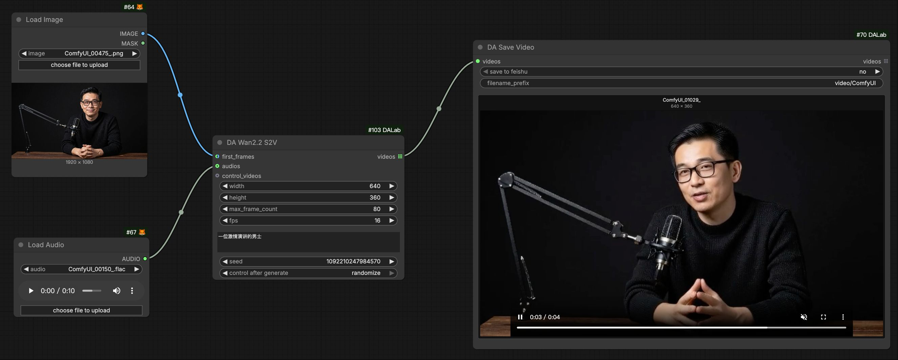
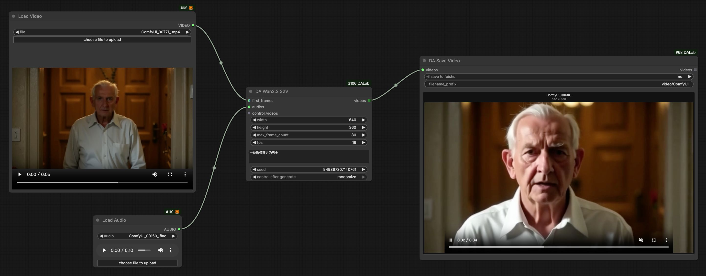
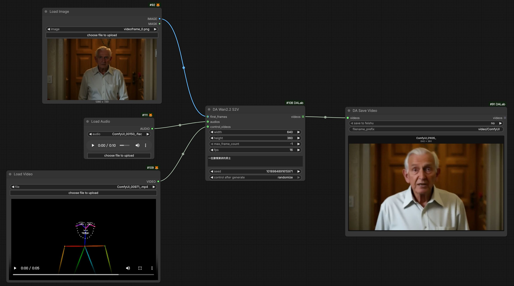
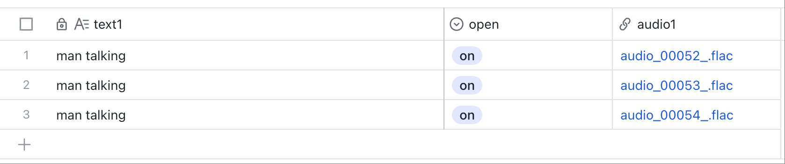
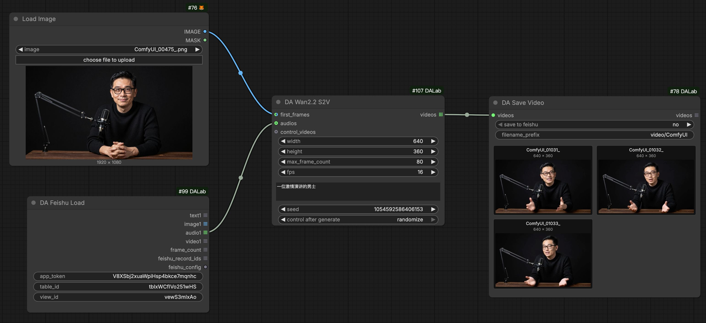

# DA Wan 2.2 S2V 节点说明
[English](wan22_s2v.md) | [中文文档](wan22_s2v_zh.md)

## 1. 基本示意

### 1. 图片+语音生成视频
通过单张参考图片和一段音频生成口型同步视频。

### 2. 视频+语音生成视频
使用现有视频作为参考生成口型同步视频。
- **参考图**: 自动截取输入视频的 **最后一帧** 作为参考图片。
- **动作**: 使用视频内容作为动作参考。

### 3. 加入 Control Video 控制
使用 **DWPose** 姿态视频来控制生成角色的动作和姿态。

### 4. 批量 S2V: 搭配 Feishu
利用 **DA Feishu Load** 批量读取配置，实现自动化生产。

## 2. 节点配置说明

**DA Wan2.2 S2V Config** 节点用于管理 Wan 2.2 S2V 模型的参数配置。
> Global Config: 搭配 [Global Config](../tools/global_config.md) 节点使用。

| 参数名 | 默认值 | 说明 |
| :--- | :--- | :--- |
| text_encoder_model | UMT5 XXL | Wan T5 文本编码器 (FP8)。 |
| vae_model | Wan 2.1 VAE | Wan VAE 模型。 |
| diffusion_model | Wan 2.2 S2V 14B | Wan 2.2 S2V 扩散模型 (14B)。 |
| audio_encoder_model | Wav2Vec2 | 音频特征提取编码器。 |
| steps | 4 | 采样步数。默认为 4。 |
| cfg | 1.0 | CFG 引导系数。默认为 1.0。 |
| shift | 5.0 | 采样偏移参数。默认为 5.0。 |
| chunk_frame_count | 77 | 单次生成的片段帧数。 |
| chunk_motion_frame_count| 73 | 动作参考片段帧数。 |
| scheduler | simple | 噪声调度器。 |
| sampler | uni_pc | 采样算法。推荐使用 'uni_pc'。 |
| negative_prompt | (默认) | 内置通用负面提示词。 |

**DA Wan2.2 S2V (生成节点)**
关键输入参数:
- **first_frames**: 参考图片或视频。
- **audios**: 输入音频。
- **control_videos**: 可选的控制视频 (如 DWPose)。
- **max_frame_count**: 限制最大生成帧数 (-1 代表不限制)。

| 参数名 | 默认值 | 说明 |
| :--- | :--- | :--- |
| width | 640 | 输出视频宽度。 |
| height | 360 | 输出视频高度。 |
| fps | 16.0 | 视频帧率。默认 16.0。 |

## 3. 环境依赖
**无特殊依赖**。安装 **ComfyUI-DALab** 插件即可直接使用。

## 4. 模型下载
> **提示**：如果您之前已经下载过相关模型，直接使用即可。

#### 1. Diffusion 模型 (S2V)
存放路径: `models/diffusion_models/`

| 模型版本 | 说明 | 下载地址 |
| :--- | :--- | :--- |
| **S2V 14B** | Wan 2.2 S2V 扩散模型 (14B) | [下载](https://huggingface.co/Comfy-Org/Wan_2.2_ComfyUI_Repackaged/tree/main/split_files/diffusion_models) |

#### 2. Audio Encoder (音频编码器)
存放路径: `models/audio_encoders/`

| 模型版本 | 说明 | 下载地址 |
| :--- | :--- | :--- |
| **Wav2Vec2** | Wav2Vec2 Large English | [下载](https://huggingface.co/Comfy-Org/Wan_2.2_ComfyUI_Repackaged/tree/main/split_files/audio_encoders) |

#### 3. Text Encoder / VAE
(与 T2V/I2V 通用)
- **Text Encoder**: `models/text_encoders/` [下载](https://huggingface.co/Comfy-Org/Wan_2.2_ComfyUI_Repackaged/tree/main/split_files/text_encoders)
- **VAE**: `models/vae/` [下载](https://huggingface.co/Comfy-Org/Wan_2.2_ComfyUI_Repackaged/tree/main/split_files/vae)
