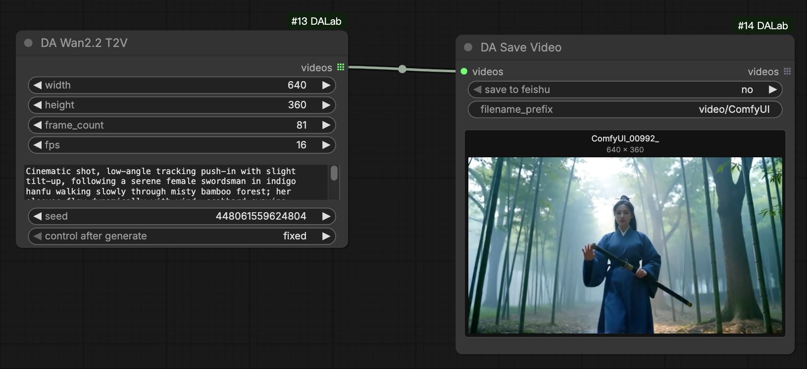
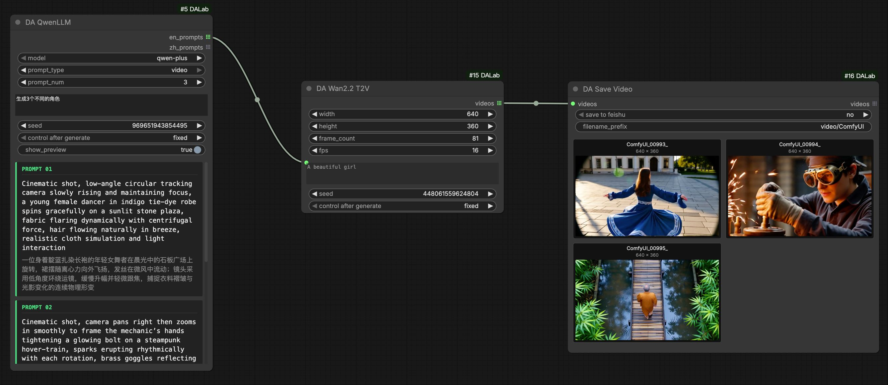
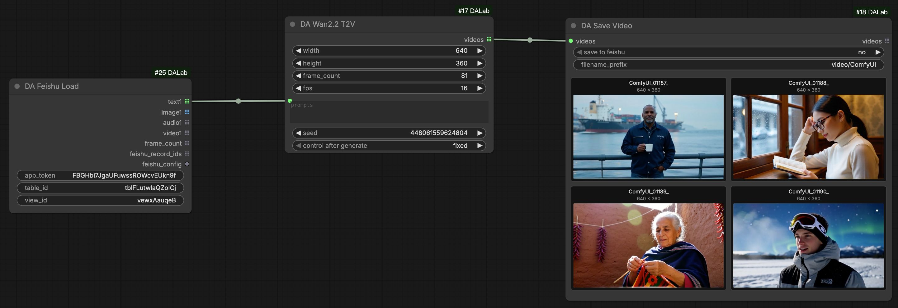

# DA Wan 2.2 T2V Node Usage
[English](wan22_t2v.md) | [中文文档](wan22_t2v_zh.md)

## 1. Basic Illustrations

### Basic T2V (Text-to-Video)
Simplest usage: After configuration, just enter prompts to generate videos.

### Batch T2V: With Qwen LLM
Use **DA Qwen LLM** to generate creative prompts in batch for automated continuous generation.
[Qwen LLM Node Usage](../text/qwen_llm.md)

### Batch T2V: With Feishu
Use **DA Feishu Load** to read prompts from a table for fully automated batch video generation.
[Feishu Node Usage](../tools/feishu.md)

## 2. Configuration Setup

**DA Wan2.2 T2V Config** node manages parameters for the Wan 2.2 T2V model.
> Global Config: Use with [Global Config](../tools/global_config.md) node to manage runtime VRAM control.

| Parameter | Default | Description |
| :--- | :--- | :--- |
| text_encoder_model | UMT5 XXL | Wan T5 Text Encoder (FP8). |
| vae_model | Wan 2.1 VAE | Wan VAE model. |
| high_model | Wan 2.2 High Noise | Wan 2.2 High Noise Diffusion Model (14B). |
| low_model | Wan 2.2 Low Noise | Wan 2.2 Low Noise Diffusion Model (14B). |
| steps | 4 | Sampling steps. Default is 4 (Lightning). |
| batch_size | 1 | Number of videos per generation. |
| cfg | 1.0 | CFG Scale. Default is 1.0. |
| shift | 5.0 | Model sampling shift parameter. Default is 5.0. |
| sampler | euler | Sampling algorithm. 'euler' recommended. |
| scheduler | simple | Noise scheduler. 'simple' recommended. |
| negative_prompt | (Default) | Built-in general negative prompts. |
| high_loras | - | Select LoRA models for High Model. |
| low_loras | - | Select LoRA models for Low Model. |

**DA Wan2.2 T2V (Generation Node)**
Supports **width**, **height**, **frame_count**, **fps**, **prompts** and **seed** inputs.

| Parameter | Default | Description |
| :--- | :--- | :--- |
| width | 640 | Output video width. |
| height | 360 | Output video height. |
| frame_count | 81 | Number of frames (duration). Default 81 frames (approx 5s @ 16fps). |
| fps | 16.0 | Frame rate. Default 16.0. |

## 3. Environment Dependencies
**No special dependencies**. Just install **ComfyUI-DALab** extension to use.

## 4. Model Downloads
> **Note**: If you have already downloaded the models, you can use them directly.

#### 1. Diffusion Models
Path: `models/diffusion_models/`

| Version | Description | Download |
| :--- | :--- | :--- |
| **High Noise 14B** | Wan 2.2 High Noise Model (14B) | [Pending Update] |
| **Low Noise 14B** | Wan 2.2 Low Noise Model (14B) | [Pending Update] |

#### 2. Text Encoder (UMT5)
Path: `models/text_encoders/`

| Version | Description | Download |
| :--- | :--- | :--- |
| **UMT5 XXL** | Wan T5 Text Encoder | [Pending Update] |

#### 3. VAE Model
Path: `models/vae/`

| Version | Description | Download |
| :--- | :--- | :--- |
| **Wan 2.1 VAE** | Wan VAE Model | [Pending Update] |
